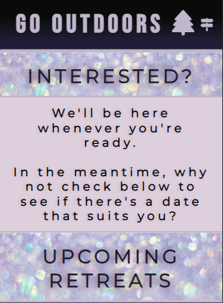
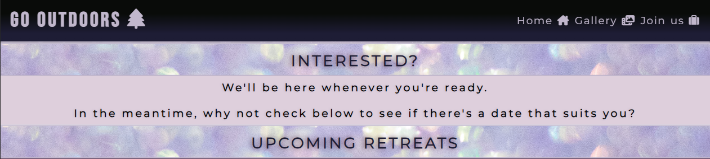

# Go Outdoors

Go Outdoors isn't just any retreat. It's a place where people from all backgrounds can come together, connect with one another, and find peace within themselves. In an increasingly digital world, we rarely have time to slow down and disconnect from our devices. What's more, we're often moving at such a fast pace that we neglect to show gratitude for each coming day. Happy or sad, we must give thanks to the universe. When we do, our gratitude is reflected back at us and our lives are blessed by magic.

## User Stories

- **As a novice**, I'm looking to immerse myself in the world of spirituality. Since it's a new field of interest for me, I want to feel a sense of mystery and intrigue, and I want to see photos of other people's experiences.

- **As a seasoned spiritualist**, I'm looking for a unique experience. I'm not keen on websites that require me to read a lot, so I want to be presented with concise information and options to find out more.

- **As an organiser**, I want to take my group to a place where they'll have opportunities to develop as individuals and as a team. Having a discussion over the phone is important to me, so I'd like to be able to arrange a callback.

## Features

For anyone who seeks deeper meaning in their life, this website will serve as a stepping stone in their pursuit. It has been designed with simplicity, ease of navigation, and aesthetics in mind. Those who would like to use it can find key information on the first page, imagery of the retreat on the second page, and a registration form on the third and final page.

### Current Features

- Header and Responsive Navigation Bar (designed using HTML and CSS **only**)
    - Its purpose is to enable users to navigate between pages without having to use the back and forward arrow buttons in their browser of choice.
    - It comprises the Logo and links to the Home, Gallery and Registration pages, as well as their accompanying Font Awesome (FA) Icons.
    - On each page, the navigation bar remains visible and fully accessible to users. It has been designed in such a way that its page links are tucked away on small devices and become untucked on large devices.

    #### Small Header
    
    
    #### Large Header
    

- Landing Page
    - Upon arrival, users are met with a starry night sky which has been overlayed with a sheen of Lavender Blush. The opening message - written in Montserrat - welcomes them, and a promise of magic - written in Sevillana - greets them just below. A magic wand FA Icon has also been added for aesthetic effect.

    #### Small Version
    
    
    #### Large Version
    

    - Scrolling further down the page, the user's attention is captured with the use of bright colouring and bold, capitalised lettering. Contrasting colours have been chosen for emphatic effect.

    #### Small Version
    

    #### Large Version
    

    - As for the third and final section, a calendar has been created for the purpose of informing users about prospective retreat dates; start dates have been highlighted with familiar section styling (as in the section above) for ease of identification.

    #### Small Version
    

    #### Large Version
    

- Footer
    - At the bottom of the page, a footer has been placed. It contains links to social media platforms, including Pinterest, Instagram and YouTube, as well as a link which opens each user's chosen email client.
    - Enabling users to visit social media profiles connected to the website will encourage them to connect and remain in touch.
    - When users click any of these links, the corresponding social media page will open in a new tab; this will reduce the likelihood that they'll navigate away from the website.

    #### Small Version
    

    #### Large Version
    

- Gallery
    - Before users decide to visit the retreat, they can look through the gallery within which photos have been ordered precisely; the purpose of the chosen design and ordering is to attract people with a proposed sequence of events. They can look through the photos, read the accompanying captions and envision their time at the retreat.
    - Enabling users to view the landscape, accomodation options and some of the activies is valuable in terms of helping them to decide whether it's the right place for them to visit.

    #### Small Version
    

    #### Large Version
    

- Registration Form
    - If users decide they want to visit the retreat based on what they've gathered from the Home page and Gallery, they can navigate to the final page and send their details via the registration form.
    - Providing users with a means of direct contact via the website enables them to reach out to us internally, thus increasing the likelihood of engagement and improving their overall experience.

    #### Small Version
    

    #### Large Version
    

### Prospective Features (TBD)

- A virtual walkthrough of the retreat. Users will be able to look around the retreat from the perspective of somebody who is there in person.
- A personality questionnaire. Users can optionally answer a series of questions in order to better understand them as individuals prior to engaging with them via their elected form of contact.

## Development Challenges

During development, a series of unfamiliar and often unexpected behaviours were observed. From flexbox positioning issues to a complete absence of navigation bar responsiveness to a footer that just wouldn't stay down, a solution was found for each and every problem.

### Flexbox Fumble

First and foremost, I think it's important to note that CSS can be very tricky - especially for novices. Flexbox, in particular, was very challenging. It's fairly straight-forward on its own, but the nature of its impact on surrounding elements alluded me initially. Over time, however, I began to understand the relationships between elements and their counterparts, and I was able to address the issues I'd been facing. For example, I learned when it was appropriate to apply flexbox properties and was eventually able to identify when they were redundant.

### Nav Bar Nightmare

Designing a responsive navigation bar without the use of Javascript proved difficult - even with Code Institute's [tutorial](https://www.youtube.com/watch?v=g6Kr1srawjc&t=505s&ab_channel=MediaUpload). In the beginning, I wanted to find my own solution but decided against it due to my own lack of experience. I attempted to follow this [tutorial](https://www.w3schools.com/howto/howto_css_dropdown_navbar.asp) and couldn't adapt it to my needs, so I abandoned it and reverted to what I knew. In the end, I was able to add the expected functionalities and styled it in accordance with my design preferences.

### Flying Footer

At one point, I thought a sticky footer would be a good idea; I wanted it to remain visible on the screen at all times. Frustratingly, I encountered issues whenever I defined its position. When I set it to `sticky`, it had absolutely no effect; when I set its propety to `absolute`, it reduced to a quarter of its specified width; and when I set it to `fixed`, it disappeared entirely. In the end, I set `margin-top` to `auto` and settled on a footer that finally stayed put.

As difficult as it was to overcome these challenges, I understood that they were an integral part of the learning process and embraced them wholeheartedly.

## Testing

- ### Home Page

    #### [Section One]
    - Beginning at the top of the page - in mobile, tablet and laptop views - I checked the header functionalities, including the drop-down list and the links. I then checked the background image, margins surrounding the introductory text, the space between the headings, and the font-sizes. Everything appeared to be in order.

    #### [Section Two]
    - Moving down the page, I checked the headings, text and background images. For a moment, I considered whether the sizing was disproportional, but as the point of this section is to capture the attention of users, I decided it was fit for purpose. No other issues were observed.

    #### [Section Three]
    - Just after the midsection, I checked the calendar properties and identified two issues. Firstly, some of the margins around the days and dates were too small. See screenshots below for issue and correction.

        ##### Calendar Margin Issue
        ![Calendar Issue [1] Screenshot)](assets/images/calendar-margin-issue.png)

        ##### Calendar Margin Correction
        ![Calendar Correction [1] Screenshot)](assets/images/calendar-margin-correction.png)

            Steps taken: `font-size` increased and `margin-right` added.

    - Secondly, I noted that the background image of the `month` and `.active` dates was causing a contrast issue with the black text. See screenshots below for issue and correction.

        ##### Calendar Contrast Issue
        ![Calendar Issue [2] Screenshot)](assets/images/calendar-contrast-issue.png)

        ##### Calendar Contrast Correction
        ![Calendar Correction [2] Screenshot)](assets/images/calendar-contrast-correction.png)

            Steps taken: `font-weight` and `font-size` were increased, as well as alignment of days and dates, changes in the colour, and removal of the background image for highlighted dates. Note: creating a calendar using only HTML and CSS was difficult; JavaScript may be incorporated in future to improve alignment and also to enable user interaction.

    - Thirdly and lastly, the calendar dimensions were checked on larger screen sizes, and a `padding-left` property was added in order to bring the calendar into the centre.

        ##### Calendar Alignment Issue
        ![Calendar Issue [3] Screenshot)](assets/images/calendar-alignment-issue.png)

        ##### Calendar Alignment Correction
        ![Calendar Correction [3] Screenshot)](assets/images/calendar-alignment-correction.png)

            Steps taken: `.calendar-container` div class selector added to media query; `font-size` and `padding-left` applied. Additionally, `margin-right` property added to `.month` div.

- ### Gallery and Registration Form
    - All screen sizes - mobile, tablet and laptop - were checked; all elements and their corresponding properties functioned as expected.

## Validator Testing

- ###  HTML
   - No errors were identified via the official [W3 Validator](https://validator.w3.org/nu)

- ### CSS
   - A 'Parse Error' was identified during testing via [W3's Jigsaw Validator](https://jigsaw.w3.org/css-validator), but when I checked the code, I couldn't find any viable errors. The line (688) on which the error was identified contains a closing curly bracket for a media query; there were no corrections to be made.

- ### Unfixed Bugs
    - As far as I was able to observe, there were no outstanding bugs to be fixed.

## Deployment

Go Outdoors was deployed to GitHub pages using the following steps:

1. Navigate to the **Go Outdoors** [repository](https://github.com/c-hut/go-outdoors/tree/main) on Github
2. Click **Settings** (last button on the header, directly above the repo)
3. On the left-hand side, find **Pages** (directly below **Codespaces**)
4. Find **Source** under **Build and deployment**; click the dropdown menu; and select **Deploy from a branch**
5. Find **Branch**; click the dropdown menu; select **main**; and set the folder to **root**
6. As per the succeeding instructions, wait and then refresh the repository. If all steps have been followed correctly, there should be a box that says: "your site is live at https://username.github.io/site-name/"

After following these steps, I deployed my website. It can be viewed [here](Your site is live at https://c-hut.github.io/go-outdoors).

## Credits

### Acknowledgements
- I would like to thank my personal mentor: Spencer Barriball. From the outset, he was exceptionally kind and knowledgable. Whenever I experienced an issue, he endeavoured to aid me in finding a timely resolution. He's a credit to his profession.

- I would also like to thank Code Institute for its unique teaching style. I can say with certainty that I'd never encountered such engaging course content previously, and I'm grateful to have had an opportunity to benefit from it.

### Code Inspiration and Support

- Code Institute's navigation bar

    ~ featured in the Love Running project

- Code Institute's form styling (code adapted - not directly copied)

    ~ featured in the Love Running project

- Calendar inspired by W3Schools [article](https://www.w3schools.com/howto/tryit.asp?filename=tryhow_css_calendar) and Reintech [article](https://reintech.io/blog/creating-a-responsive-calendar-with-css)

- [MDN Web Docs](https://developer.mozilla.org/en-US/) was used to fill knowledge gaps.

    - **Key topics**: flexbox, flex properties, padding, margin, and positioning.

- [Stack Overflow](https://stackoverflow.com) was also used to fill knowledge gaps.

    - **Key topics**: media queries, form input types, image properties, and selectors.

### Media

- [Favicon.io](https://favicon.io/emoji-favicons/evergreen-tree) was used to select the Favicon icon for the browser tab.

    

- [Coolers](https://coolors.co) was used to generate a colour palette.

    

- [Font Awesome](https://fontawesome.com) was used to select header and menu icons.

- [Google Fonts](https://fonts.google.com) was used to generate font styles.

    - Bebas Neue

    
    
    - Montserrat

    

    - Sevillana

    

- [iLoveIMG](https://www.iloveimg.com) was used for image resizing.

- [Cloud Convert](https://cloudconvert.com) was used for image conversion (png and jpg to webp).

- [CSS Gradient](https://cssgradient.io) was used for header and footer styling.

- [Markdown Guide](https://www.markdownguide.org/cheat-sheet) was used for writing the README.md file.

- [Am I Responsive?](https://ui.dev/amiresponsive) was used to generate the opening screenshot.