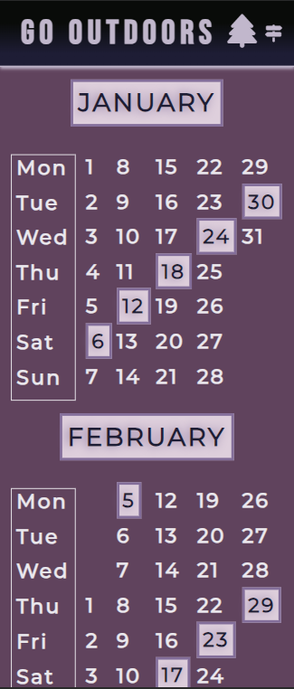
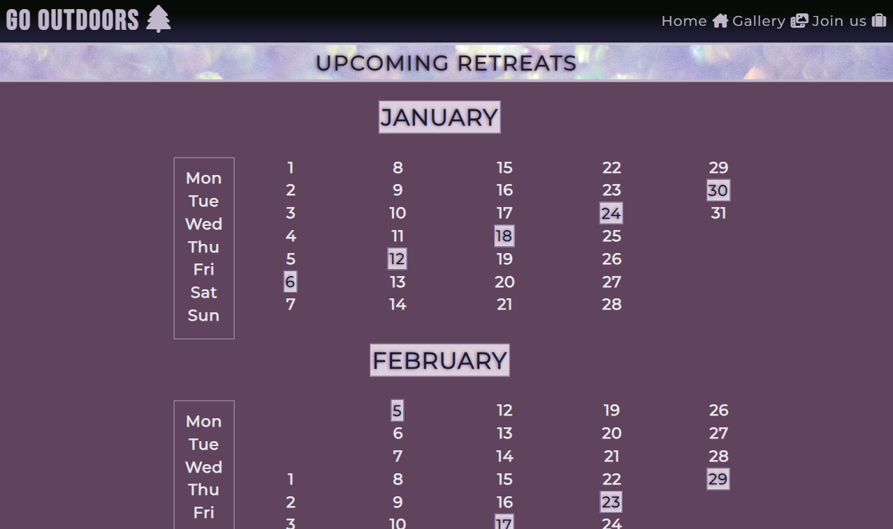
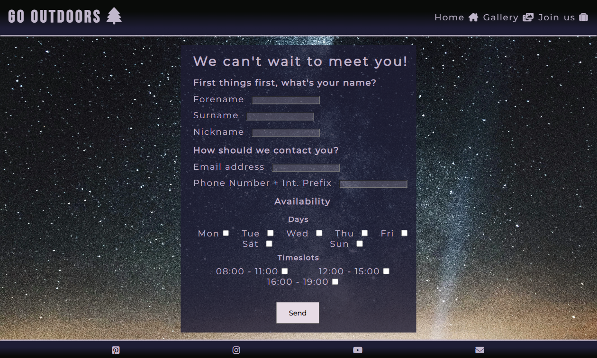

# Go Outdoors

Go Outdoors isn't just any retreat. It's a place where people from all backgrounds can come together, connect with one another, and find peace within themselves. In an increasingly digital world, we rarely have time to slow down and disconnect from our devices. What's more, we're often moving at such a fast pace that we neglect to show our gratitude for each new day. Happy or sad, we must give thanks to the universe. When we do, our gratitude is reflected back at us and our lives are touched by magic.

## Features

For anyone who seeks deeper meaning in their life, this website will serve as a stepping stone in their pursuit. It has been designed with simplicity, ease of navigation, and aesthetics in mind. Anyone who would like to use it can find key information on the first page, imagery of the retreat on the second page, and a registration form on the third and final page. 

N.B. The first page has been designed to intrigue its visitors, thus detailed information about the retreat has not been included. All interested parties will receive a comprehensive overview upon receipt of their registration form.

### Current Features

- Header and Responsive Navigation Bar (designed using HTML and CSS **only**)
    - Its purpose is to enable users to navigate between pages without having to use the back and forward arrow buttons in their browser of choice.
    - It comprises the Logo and links to the Home, Gallery and Registration pages, as well as their accompanying Font Awesome (FA) Icons.
    - On each page, the navigation bar remains visible and fully accessible to users. It has been designed in such a way that its page links are tucked away on small devices and become untucked on large devices.

    ##### Small Header
    
    
    ##### Large Header
    

- Landing Page
    - Upon arrival, users are met with a starry night sky which has been overlayed with a sheen of Lavender Blush. The opening message - written in Montserrat - welcomes them, and a promise of magic - written in Sevillana - greets them just below. A magic wand FA Icon has also been added for aesthetic effect.

    ##### Small Version
    
    
    ##### Large Version
    

    - Scrolling further down the page, the user's attention is captured with the use of bright colouring and bold, capitalised lettering. Contrasting colours have been chosen for emphatic effect.

    ##### Small Version
    

    ##### Large Version
    

    - As for the third and final section, a calendar has been created for the purpose of informing users about prospective retreat dates; start dates have been highlighted with familiar section styling (as in the section above) for ease of identification.

    ##### Small Version
    

    ##### Large Version
    

- Footer
    - At the bottom of the page, a footer has been placed. It contains links to social media platforms, including Pinterest, Instagram and YouTube, as well as a link which opens each user's chosen email client.
    - Enabling users to visit social media profiles connected to the website will encourage them to connect and remain in touch.
    - When users click any of these links, the corresponding social media page will open in a new tab; this will reduce the likelihood that they'll navigate away from the website.

    ##### Small Version
    

    ##### Large Version
    

- Gallery
    - Before users decide to visit the retreat, they can look through the gallery within which photos have been ordered precisely; the purpose of the chosen design and ordering is to attract people with a proposed sequence of events. They can look through the photos, read the accompanying captions and envision their time at the retreat.
    - Enabling users to view the landscape, accomodation options and some of the activies is valuable in terms of helping them to decide whether it's the right place for them to visit.

    ##### Small Version
    

    ##### Large Version
    

- Registration Form
    - If users decide they want to visit the retreat based on what they've gathered from the Home page and Gallery, they can navigate to the final page and send their details via the registration form.
    - Providing users with a means of direct contact via the website enables them to reach out to us internally, thus increasing the likelihood of engagement and improving their overall experience.

    ##### Small Version
    

    ##### Large Version
    

### Prospective Features (TBD)

- A virtual walkthrough of the retreat. Users will be able to look around the retreat from the perspective of somebody who is there in person.
- A personality questionnaire. Users can optionally answer a series of questions in order to better understand them as individuals prior to engaging with them via their elected form of contact.

## Development

During development, a series of unfamiliar and often unexpected behaviours were observed. From flexbox positioning issues to a complete absence of navigation bar responsiveness to a footer that just wouldn't stay down, a solution was found for each and every problem.

### Flexbox Fumble

First and foremost, I think it's important to note that CSS can be very tricky - especially for novices. Flexbox, in particular, was very challenging. It's fairly straight-forward on its own, but the nature of its impact on surrounding elements alluded me initially. Over time, however, I began to understand the relationships between elements and their counterparts, and I was able to address the issues I'd been facing. For example, I learned when it was appropriate to apply flexbox properties and was eventually able to identify when they were redundant.

### Navigation Bar Nightmare

Designing a responsive navigation bar without the use of Javascript proved difficult - even with Code Institute's tutorial. In the beginning, I wanted to find my own solution but decided against it due to my own lack of experience. I attempted to follow this [tutorial](https://www.w3schools.com/howto/howto_css_dropdown_navbar.asp) and couldn't adapt it to my needs, so I abandoned it and reverted to what I knew. In the end, I was able to add the expected functionalities and styled it in accordance with my design preferences.

### Flying Footer

At one point, I thought a sticky footer would be a good idea; I wanted it to remain visible on the screen at all times. I encountered issues whenever I defined its position. when I set it to `sticky`, it had absolutely no effect; when I set its propety to `absolute`, it reduced to a quarter of its specified width; and when I set it to `fixed`, it disappeared entirely. In the end, I set `margin-top` to `auto` and settled on a footer that finally stayed put.

## Testing

