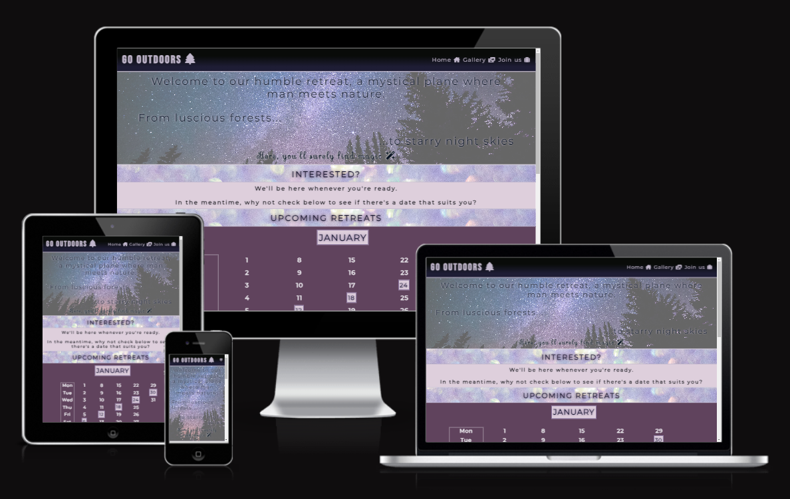
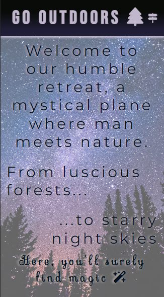

# Go Outdoors

Go Outdoors isn't just any retreat. It's a place where people from all backgrounds can come together, connect with one another, and find peace within themselves. In an increasingly digital world, we rarely have time to slow down and disconnect from our devices. What's more, we're often moving at such a fast pace that we neglect to show our gratitude for each new day. Happy or sad, we must give thanks to the universe. When we do, our gratitude is reflected back at us and our lives are touched by magic.

## Features

For anyone who seeks deeper meaning in their life, this website will serve as a stepping stone in their pursuit. It has been designed with simplicity, ease of navigation, and aesthetics in mind. Anyone who would like to use it can find key information on the first page, imagery of the retreat on the second page, and a registration form on the third and final page. 

N.B. The first page has been designed to intrigue its visitors, thus detailed information about the retreat has not been included. All interested parties will receive a comprehensive overview upon receipt of their registration form.

### Current Features

- Responsive Navigation Bar (designed using HTML and CSS **only**)
    - Its purpose is to enable users to navigate between pages without having to use the back and forward arrow buttons in their browser of choice.
    - It comprises the Logo and links to the Home, Gallery and Registration pages, as well as their accompanying Font Awesome (FA) Icons.
    - On each page, the navigation bar remains visible and fully accessible to users. It has been designed in such a way that its page links are tucked away on small devices and become untucked on large devices.

    ##### Small Header
    
    
    ##### Large Header
    

- Landing Page
    - Upon arrival, users are met with a starry night sky which has been overlayed with a sheen of Lavender Blush. The opening message - written in Montserrat - welcomes them, and a promise of magic - written in Sevillana - greets them just below. A magic wand FA Icon has also been added for aesthetic effect.

    ##### Small Version
    
    
    ##### Large Version
    

    - Scrolling further down the page, 